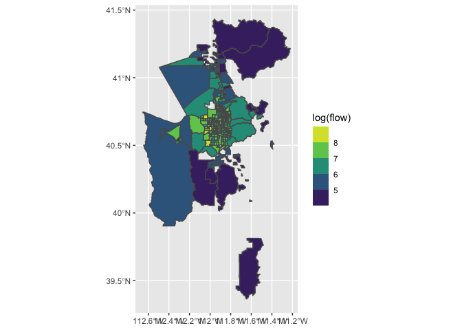

<!-- README.md is generated from README.Rmd. Please edit that file -->

# ctppflows

<!-- badges: start -->
<!-- badges: end -->

The goal of ctppflows is to provide tract level home-work flow data from
the Census Transportation Planning Package (CTPP) in a much more
convenient format for R users, particularly those without a Microsoft
Access license.

The entire tract dataset is included in the package as a documented R
object, and the package also contains helper functions for properly
calculating aggregate flows and their margins of error.

## Installation

You can install the development version of ctpp\_flows from
[GitHub](https://github.com/) with:

``` r
# install.packages("devtools")
devtools::install_github("gregmacfarlane/ctpp_flows")
```

## Example

After installing the library, the `ctpp_flows` dataset is available as a
tibble lazy-loaded into your environment.

``` r
library(ctppflows)

# load 
ctpp_flows
#> # A tibble: 4,156,426 x 4
#>    residence   workplace    flow flow_moe
#>    <chr>       <chr>       <int>    <int>
#>  1 06073018700 06073018700 20950     2359
#>  2 51710000902 51710000902 10155     2516
#>  3 45079011501 45079011501  8735      875
#>  4 13215010802 13215010802  7720     1144
#>  5 06071010402 06071010402  7040      848
#>  6 12033002400 12033002400  6480      838
#>  7 08041003802 08041003802  6380      583
#>  8 36071013600 36071013600  5430      551
#>  9 48029161400 48029161400  5410      909
#> 10 17097863003 17097863003  5245     1069
#> # … with 4,156,416 more rows
```

The `aggregate_flows` function will aggregate the flows to a state or
county. The aggregated margin of error is computed as

$$ \\sqrt{\\sum\_{i=1}^N MOE\_i^2}$$

``` r
aggregate_flows("state")
#> # A tibble: 2,312 x 4
#> # Groups:   residence [52]
#>    residence workplace    flow    moe
#>    <chr>     <chr>       <int>  <dbl>
#>  1 01        01        1651840 9895. 
#>  2 01        02             25   31.3
#>  3 01        04            135  100. 
#>  4 01        05            356  180. 
#>  5 01        06            587  289. 
#>  6 01        08            170   93.2
#>  7 01        09             55   35.3
#>  8 01        10             20   31  
#>  9 01        11             87  129. 
#> 10 01        12           7089 1047. 
#> # … with 2,302 more rows
```

The results can then be passed into other R formatting functions. For
instance, we could make a plot of where workers into Salt Lake County
reside.

``` r
# get workplaces in salt lake county
sl_workers <- ctpp_flows %>%
  mutate(county = str_c(get_state(workplace), get_county(workplace))) %>%
  filter(county == "49035") %>%
  filter(flow > 50) %>%
  group_by(residence) %>%
  summarise(flow = sum(flow))

ut_tr <- tigris::tracts("Utah", class = "sf", progress_bar = FALSE) %>%
  select(GEOID) %>%
  left_join(sl_workers, by = c("GEOID" = "residence"))

ggplot(ut_tr %>% filter(flow > 0), aes(fill = log(flow))) +
  geom_sf() + scale_fill_viridis_b()
```


